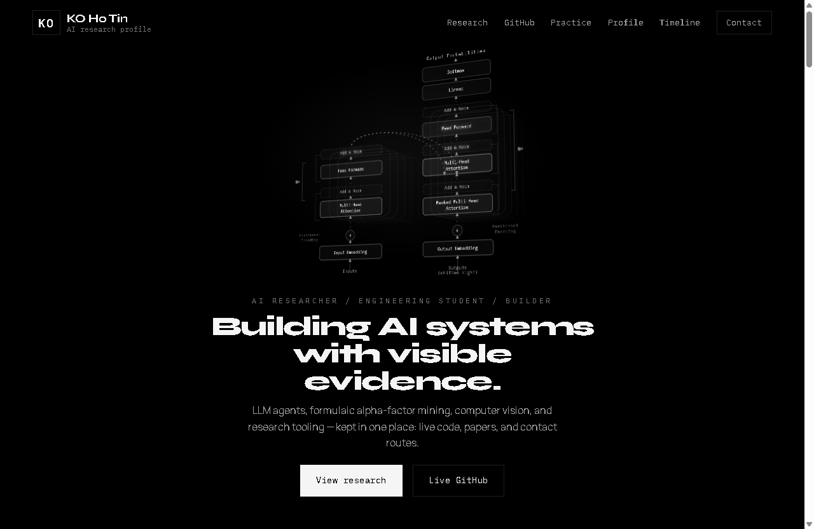

<div align="center">

# KO Ho Tin — AI Research Profile

**Building AI systems with visible evidence.**

LLM agents · formulaic alpha-factor mining · computer vision · research tooling

[](https://b143kc47.github.io)
[](https://openreview.net/forum?id=d97Q8r7ZKZ)
[](https://orcid.org/0009-0002-7298-8196)
[](#license)

<a href="https://b143kc47.github.io"></a>

</div>

## About

Personal research profile of **KO Ho Tin** (BlackCat / `B143KC47`) — an AI researcher and
engineering student in Hong Kong working on LLM agents, quantitative AI, computer vision,
and evaluation. The site keeps the evidence in one place: live code, published papers, and
direct contact routes.

It is a single static page in a strict **monochrome "Signal"** design — black, white, and
gray only; `Syne` for display, `Manrope` for body, `IBM Plex Mono` for labels and data.

## Selected research

- **AlphaBench: Benchmarking Large Language Models in Formulaic Alpha Factor Mining** —
  *ICLR 2026 Poster.* The first systematic benchmark for LLMs in formulaic alpha-factor
  mining (generation, evaluation, search). [OpenReview](https://openreview.net/forum?id=d97Q8r7ZKZ)
- **EvoAlpha: Evolutionary Alpha Factor Discovery with Large Language Models** —
  *GenAI in Finance Poster.* An LLM-guided evolutionary framework for interpretable
  alpha-factor discovery. [OpenReview](https://openreview.net/forum?id=ALpLmURYWy)

## What's on the site

- **3D Transformer hero** — the "Attention Is All You Need" architecture (Vaswani et al., 2017)
  rebuilt as a live CSS-3D + SVG scene. Pure SVG/CSS/JS — no Three.js, no CDN, no build step.
- **Live GitHub feed** — public repositories pulled from the GitHub API on load, scored and ranked.
- **Auto-synced publications** — a scheduled GitHub Action fetches publications from the
  OpenReview API daily and commits the data, so the research list stays current with no manual edits.
- **Practice trail** — LeetCode and Kaggle profiles shown as monochrome stat cards (solved-by-difficulty
  bar, Kaggle tier ladder), framed as active practice rather than a leaderboard.
- **Quality floor** — responsive to mobile, keyboard-navigable, custom cursor + card tilt for fine
  pointers, and `prefers-reduced-motion` honored throughout.

## Tech

Vanilla **HTML · CSS · JavaScript** — no framework and no build step, so the page also runs by
double-clicking `index.html` (`file://`). Data freshness is handled by **GitHub Actions**, and the
site is served from **GitHub Pages**.

```
index.html                         # the whole page + inline JSON data (publications, profiles)
modules/
  startup-redesign.js              # nav, reveals, GitHub + publications + practice rendering, cursor/tilt
  transformer-arch.js              # the 3D Transformer-architecture hero
styles/
  startup-redesign.css             # design system + all section styles
  cosmic.css                       # custom cursor + card-tilt interaction layer
data/publications.json             # OpenReview data (refreshed by the workflow)
.github/workflows/                 # daily OpenReview publication sync
assets/                            # portrait, preview, certificates
```

## Run locally

No tooling required:

```bash
git clone https://github.com/B143KC47/B143KC47.github.io.git
cd B143KC47.github.io
# either just open index.html in a browser, or serve it:
python -m http.server 8000   # then visit http://localhost:8000
```

## Connect

- **Website** — [b143kc47.github.io](https://b143kc47.github.io)
- **GitHub** — [B143KC47](https://github.com/B143KC47)
- **OpenReview** — [~Ho_Tin_Ko2](https://openreview.net/profile?id=~Ho_Tin_Ko2)
- **Google Scholar** — [Ho Tin Ko](https://scholar.google.com/scholar?q=%22Ho+Tin+Ko%22)
- **ORCID** — [0009-0002-7298-8196](https://orcid.org/0009-0002-7298-8196)
- **LeetCode** — [B143KC47](https://leetcode.com/u/B143KC47/)
- **Kaggle** — [b14ckc4tmr](https://www.kaggle.com/b14ckc4tmr)
- **LinkedIn** — [BlackCat](https://www.linkedin.com/in/blackcat/)

## License

All Rights Reserved. © KO Ho Tin. The code may be viewed for reference; reuse of the design,
content, or assets requires permission.
