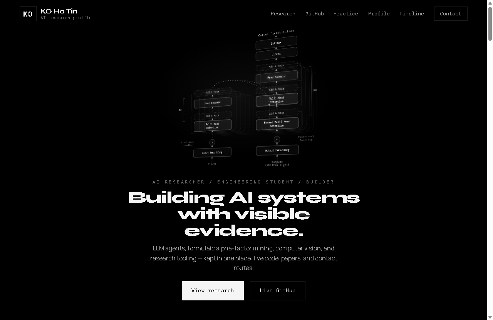

<div align="center">

# KO Ho Tin — AI Research Profile

**Building AI systems with visible evidence.**

LLM agents · formulaic alpha-factor mining · computer vision · research tooling

[](https://b143kc47.github.io)
[](https://openreview.net/forum?id=d97Q8r7ZKZ)
[](https://orcid.org/0009-0002-7298-8196)
[](#license)

<a href="https://b143kc47.github.io"></a>

</div>

## About

Personal research profile of **KO Ho Tin** (BlackCat / `B143KC47`) — an AI researcher and
engineering student in Hong Kong working on LLM agents, quantitative AI, computer vision,
and evaluation. The site keeps the evidence in one place: live code, published papers, and
direct contact routes.

It is a single static page in a strict **monochrome "Signal"** design — black, white, and
gray only; `Syne` for display, `Manrope` for body, `IBM Plex Mono` for labels and data.

## Selected research

- **AlphaBench: Benchmarking Large Language Models in Formulaic Alpha Factor Mining** —
  *ICLR 2026 Poster.* The first systematic benchmark for LLMs in formulaic alpha-factor
  mining (generation, evaluation, search). [OpenReview](https://openreview.net/forum?id=d97Q8r7ZKZ)
- **EvoAlpha: Evolutionary Alpha Factor Discovery with Large Language Models** —
  *GenAI in Finance Poster.* An LLM-guided evolutionary framework for interpretable
  alpha-factor discovery. [OpenReview](https://openreview.net/forum?id=ALpLmURYWy)

## What's on the site

- **3D Transformer hero** — the "Attention Is All You Need" architecture (Vaswani et al., 2017)
  rebuilt as a live CSS-3D + SVG scene. Pure SVG/CSS/JS — no Three.js, no CDN, no build step.
- **Research cards with real paper figures** — each publication renders as a compact academic row
  (figure thumbnail, highlighted author list with `*` equal-contribution marks, venue/tags,
  2-line abstract with expand, and [PDF] [OpenReview/Anthology] [Project] [Code] links). Figures
  are **auto-extracted from the OpenReview PDFs** by a scheduled Action
  (`scripts/fetch-paper-figures.mjs`); a `"source": "manual"` entry in `data/paper-figures.json`
  pins a hand-picked figure.
- **Writing feed** — articles from CSDN, Zhihu, and the [BlackCat blog](https://b143kc47.github.io/blog/)
  in one filterable list, with CSDN thumbnails and summaries. Refreshed daily by
  `scripts/fetch-writings.mjs` (blog scrape + CSDN's public JSON API). Zhihu has no official
  public API and its web API requires app auth, so cross-posted articles are linked with a
  `zhihuUrl` mirror badge on the CSDN entry instead of being scraped.
- **Live GitHub feed** — public repositories pulled from the GitHub API on load, scored and ranked.
- **Auto-synced publications** — a scheduled GitHub Action fetches publications from the
  OpenReview API daily and commits the data, so the research list stays current with no manual edits.
  The **ORCID public API** (`0009-0002-7298-8196`) is merged on every run as a cross-check —
  any ORCID work not covered by OpenReview/manual pins is appended automatically (Google Scholar
  has no public API and captcha-walls bots, so ORCID is the automated source of truth).
  Papers OpenReview does not host (e.g. the ACL Anthology demo) are pinned as `"source": "manual"`
  entries and survive every sync; `equalContribution` lists render as co-first-author `*` marks.
- **Practice trail** — LeetCode and Kaggle profiles shown as monochrome stat cards (solved-by-difficulty
  bar, Kaggle tier ladder), plus a **Kaggle competition record**: dense cards with competition
  cover art, organizer logo, rank/total (top %) — the final **private-leaderboard** rank for
  ended competitions, public otherwise — score, submission count, prize, team count and
  deadline, an official Kaggle medal label when awarded, plus optional write-up links. Medal
  labels come directly from Kaggle's public profile competition feed and are cross-checked
  against its aggregate medal totals; they are never inferred from rank. Synced daily by
  `scripts/fetch-kaggle.mjs` via the official API (`KAGGLE_API_TOKEN` secret); only competitions
  with ≥ 1 submission are listed —
  the same ones the Kaggle profile page shows. Covers/logos are downloaded to
  `assets/competitions/`; when Kaggle has no open-graph image for a competition, a branded
  fallback cover (hatch texture + organizer logo plate + competition name) is rendered
  locally with `@napi-rs/canvas` + `pngjs` and saved as `gen-<slug>.png` — the separate
  filename never blocks a later official download. Write-ups stay
  curated per-slug in `data/profiles.json` → `kaggle.competitionList` and are preserved across refreshes.
- **Quality floor** — dark + **light mode** (header toggle, `localStorage` + `prefers-color-scheme`
  default, no flash of wrong theme; the 3D hero stays black in both), responsive to mobile,
  keyboard-navigable, custom cursor + card tilt for fine pointers, and `prefers-reduced-motion`
  honored throughout.

## Tech

Vanilla **HTML · CSS · JavaScript** — no framework and no build step, so the page also runs by
double-clicking `index.html` (`file://`). Data freshness is handled by **GitHub Actions**, and the
site is served from **GitHub Pages**.

```
index.html                         # the whole page + inline JSON data (publications, profiles, figures, writings)
modules/
  startup-redesign.js              # nav, reveals, GitHub + publications + writings + practice rendering, cursor/tilt
  transformer-arch.js              # the 3D Transformer-architecture hero
styles/
  startup-redesign.css             # design system + all section styles
  cosmic.css                       # custom cursor + card-tilt interaction layer
data/
  publications.json                # OpenReview data (daily Action) + manual pins (ACL Anthology)
  paper-figures.json               # per-paper figure + PDF/project/code links (daily Action, manual pins)
  writings.json                    # CSDN / blog articles + Zhihu mirror links (daily Action, manual pins)
  profiles.json                    # LeetCode + Kaggle cards + auto-synced Kaggle competition list
scripts/
  fetch-publications.mjs           # OpenReview + ORCID -> publications (preserves manual pins)
  fetch-paper-figures.mjs          # OpenReview PDF -> assets/papers/<id>.png (needs npm ci: pdfjs-dist + pngjs)
  fetch-writings.mjs               # blog + CSDN -> writings
  fetch-kaggle.mjs                 # Kaggle stats + competition history + covers/org logos (needs npm ci: fflate + pngjs + @napi-rs/canvas; KAGGLE_API_TOKEN secret)
  fetch-leetcode.mjs               # LeetCode stats
.github/workflows/                 # daily syncs: publications, paper figures, writings, kaggle, leetcode
assets/                            # portrait, preview, certificates, papers/ (figures), competitions/ (covers + org logos)
```

`package.json` / `node_modules` exist **only for CI tooling** (PDF figure extraction, Kaggle
leaderboard unzip) — the site itself still ships zero dependencies and no build step.

## Run locally

No tooling required:

```bash
git clone https://github.com/B143KC47/B143KC47.github.io.git
cd B143KC47.github.io
# either just open index.html in a browser, or serve it:
python -m http.server 8000   # then visit http://localhost:8000
```

## Connect

- **Website** — [b143kc47.github.io](https://b143kc47.github.io)
- **GitHub** — [B143KC47](https://github.com/B143KC47)
- **OpenReview** — [~Ho_Tin_Ko2](https://openreview.net/profile?id=~Ho_Tin_Ko2)
- **Google Scholar** — [Ho Tin Ko](https://scholar.google.com/scholar?q=%22Ho+Tin+Ko%22)
- **ORCID** — [0009-0002-7298-8196](https://orcid.org/0009-0002-7298-8196)
- **LeetCode** — [B143KC47](https://leetcode.com/u/B143KC47/)
- **Kaggle** — [b14ckc4tmr](https://www.kaggle.com/b14ckc4tmr)
- **Zhihu** — [B143KC47](https://www.zhihu.com/people/B143KC47)
- **CSDN** — [B143KC47](https://blog.csdn.net/B143KC47)
- **Blog** — [BlackCat](https://b143kc47.github.io/blog/)
- **LinkedIn** — [Ho Tin Ko](https://www.linkedin.com/in/kohotin/)

## License

All Rights Reserved. © KO Ho Tin. The code may be viewed for reference; reuse of the design,
content, or assets requires permission.
